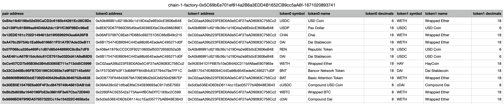

# Dex data collector

> Get all pair info from decentralized exchange with `eth_call` quickly, without deploy contract.
> 
> Support all uniswap-v2-similar dex

# Usage
```shell
# build
go build -o dex-data main.go

# download eth mainnet uniswap v2 pairs
./dex-data -r https://eth.public-rpc.com -f 0x5C69bEe701ef814a2B6a3EDD4B1652CB9cc5aA6f

# include token info
./dex-data -r https://eth.public-rpc.com -f 0x5C69bEe701ef814a2B6a3EDD4B1652CB9cc5aA6f -i true
```
- Above command will generate a csv file at current directory
- Output result:


## Compile solidity contract
- use below commond to compile when contract was changed.
- compile with [crytic-compile](https://github.com/crytic/crytic-compile)
```shell
crytic-compile contracts/DataCollector.sol --export-format standard --export-dir build
```